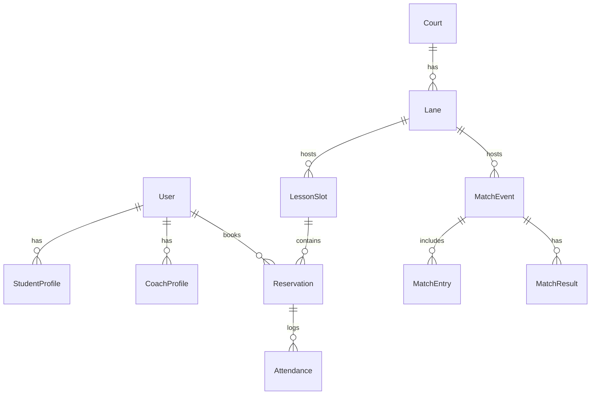

# TennisMate 基本設計書

版: v0.1 (ドラフト)
作成日: YYYY-MM-DD

## 1. 概要
TennisMate はテニススクール運営に必要なレッスン・試合・予約・成績・コーチ業務を一元管理するクラウドシステムである。Next.js (t3-app) をベースに、tRPC + Prisma + NextAuth と PostgreSQL (Neon) により型安全なフルスタックを実現し、Vercel へデプロイする。ダッシュボードで主要KPI（予約率・試合成績・出席率・売上・レーン稼働率）を可視化し、意思決定を支援する。

## 2. 目的・ゴール
- 予約/スケジュール管理の効率化（重複/キャンセル/振替の削減）
- 生徒・コーチ・コート情報の統合管理
- KPI 可視化による運営最適化（集客・稼働・品質向上）
- RBAC による安全な権限管理と運用効率の両立

## 3. 対象ユーザとロール
- ADMIN: スクール管理者。全機能・設定・請求・コーチ配置・料金設定・ダッシュボード全体閲覧
- COACH: コーチ。担当レッスン管理、出席記録、試合結果入力、連絡、シフト希望
- STUDENT: 受講生/保護者。レッスン/試合の予約・確認、出欠、支払い、成績確認

RBAC 概要:
- ADMIN: 全 read/write
- COACH: 自担当のレッスン/予約/試合/出席/成績の read/write、ダッシュボードの一部 read
- STUDENT: 自身の予約/出欠/成績/支払いの read/write、他は read 禁止

## 4. スコープ（機能一覧）
1) アカウント/認証
  - NextAuth による Email/Provider 認証、パスワードレス可
  - プロファイル: StudentProfile / CoachProfile
2) 予約/スケジュール
  - レッスン/試合の枠作成（日時・コート/レーン・定員・種別）
  - 予約/キャンセル/振替、ウェイトリスト
  - 出欠管理（コーチ記録・学生自己申告）
3) 試合/成績
  - 試合イベント作成、エントリー、対戦表、スコア入力
  - 成績集計（勝率、ランキング、期間別）
4) コーチ業務
  - シフト、担当割り当て、レッスン記録、連絡/アナウンス
5) ダッシュボード
  - 予約率、出席率、売上、レーン稼働率、試合成績
6) 請求/支払い（段階導入）
  - プラン/チケット/ドロップイン、決済連携(将来: Stripe)
7) 設定
  - コート/レーン、料金、キャンセルポリシー、祝日/休講、通知設定

非スコープ(初期): 多店舗横断分析、高度な在庫(物販)、外部会計連携

## 5. 画面・ナビゲーション（概要）
- ログイン/サインアップ
- ダッシュボード（ADMIN/COACH/学生向けに内容調整）
- カレンダー（レッスン/試合）: 月/週/日表示、フィルタ（コーチ、レーン、レベル）
- 予約詳細/作成/編集、キャンセル、ウェイトリスト
- 出欠記録/成績入力
- 生徒/コーチ/コート（台帳）
- 設定（料金、ポリシー、通知、レーン定義）

Next.js App Router ページ例:
- `/dashboard`
- `/schedule` (カレンダー)
- `/lessons/[id]`
- `/matches/[id]`
- `/reservations`
- `/admin/settings`
- `/people/students`, `/people/coaches`

## 6. アーキテクチャ
- フロントエンド: Next.js (t3-app), TypeScript, MUI, Chart.js/Recharts
- API: tRPC ルータ（型安全な RPC）
- データ: Prisma (PostgreSQL/Neon)
- 認証: NextAuth (Email/Provider), RBAC ミドルウェア
- デプロイ: Vercel (Build/Preview/Prod)

コンポーネント構成（FE 概要）
- `src/features/*` ドメインごとのフロー: schedule, reservation, match, attendance, dashboard, billing
- `src/components/*` 共通 UI (Table, Form, Calendar, Charts)
- `src/lib/*` 認可/日付/数値/チャートユーティリティ、API クライアント

シーケンス（例: 予約作成）
1. 学生が UI から枠選択 -> `reservation.create` を tRPC 呼出
2. サーバで認可/定員/重複チェック -> Prisma トランザクションで Reservation 作成
3. 成功時: 通知キュー登録（将来）-> UI 更新

## 7. データモデル（概要）
主要エンティティ:
- User: id, role (ADMIN/COACH/STUDENT), email, name
- StudentProfile: userId(FK), level, birthday, guardians
- CoachProfile: userId(FK), certifications, bio
- Court: id, name, indoor, lanes
- Lane: id, courtId(FK), index
- LessonSlot: id, dateTimeStart, dateTimeEnd, laneId(FK), capacity, level, coachId(FK), type(group/private)
- Reservation: id, slotId(FK), studentId(FK), status(booked/cancelled/waitlisted), reservedAt
- Attendance: id, reservationId(FK), status(present/absent/late)
- MatchEvent: id, date, laneId(FK), format(singles/doubles), level
- MatchEntry: id, eventId(FK), studentId(FK), team(optional)
- MatchResult: id, eventId(FK), winnerEntryId(FK), scoreText, stats(json)
- PricingPlan: id, name, price, unit, rules(json)
- Payment(将来): id, studentId(FK), amount, status

Mermaid ER（簡略）

## 8. API 設計（tRPC ルータ概要）
- `auth`: getSession, signIn, signOut
- `users`: getMe, getById, search, updateProfile
- `schedule`: listSlots, createSlot(Admin/Coach), updateSlot, deleteSlot
- `reservation`: create, cancel, listMine, waitlist, move
- `attendance`: mark, bulkMark, listBySlot
- `match`: createEvent, registerEntry, generateBracket, recordResult, rankings
- `dashboard`: kpiOverview, kpiTimeseries, laneUtilization
- `settings`: courts/lanes CRUD, pricing, policies

リクエスト/レスポンスは zod スキーマで型定義。認可はルータミドルウェアでロールチェック + リソース所有権検証を実施。

## 9. RBAC/認可ポリシー
- ADMIN: すべてのリソースに対する CRUD
- COACH: 自担当 `LessonSlot`/`MatchEvent`/`Reservation`/`Attendance` の CRUD、他は read 限定
- STUDENT: 自分の `Reservation`/`Attendance`/`MatchEntry`/`Payment` の CRUD、それ以外は不可
ガード: tRPC middleware で `ctx.session.user.role` とリソースの `coachId`/`studentId`/所有チェックを強制。

## 10. KPI 定義（Dashboard）
- 予約率 = 予約数 / 枠総数（期間・レベル・コーチでフィルタ）
- 出席率 = 出席件数 / 予約件数
- 売上 = 決済確定金額合計（初期はダミー or 計算ルール）
- レーン稼働率 = 実施時間 / 稼働可能時間（レーン単位）
- 試合成績 = 勝率・ランキング（期間・レベル別）
チャート: 折れ線/棒/円 + 時系列、MUI + Chart.js/Recharts を利用。

## 11. 非機能要件
- セキュリティ: NextAuth + HTTPS、CSRF、パスワードレス時はメールリンク期限、RBAC 徹底
- 可用性: Vercel + Neon の SLA を前提、重要操作のリトライ戦略
- 性能: 主要 API < 500ms p95、ダッシュボード集計はキャッシュ
- ログ/監査: 重要イベント（予約/キャンセル/成績更新）を監査テーブルへ（将来拡張）
- アクセシビリティ: キーボード操作/コントラスト/ARIA 準拠
- レスポンシブ: PC とスマートフォンから快適に利用可能（MUI ブレークポイント: xs~xl、目標ビューポート 375/768/1024/1440）

## 12. 通知/連携（初期案）
- メール通知: 予約作成/変更/キャンセル、出欠リマインド
- プッシュ通知（将来）: PWA で段階導入
- 外部連携: 決済(Stripe)、メール(Postmark/SES) は将来導入

## 13. デプロイ/環境変数
- 環境: Dev/Preview/Prod（Vercel）
- DB: Neon PostgreSQL（各環境で分離）
- 主な環境変数
  - `DATABASE_URL`
  - `NEXTAUTH_SECRET`, `NEXTAUTH_URL`
  - `EMAIL_PROVIDER_*`（導入時）

## 14. テスト方針（概要）
- フロント: Vitest + React Testing Library、主要フローの統合テスト
- サーバ: tRPC プロシージャの単体/結合テスト、zod バリデーション
- DB: Prisma のリポジトリ層をテスト用 DB で検証
- カバレッジ: 変更ファイル 80% 以上

## 15. 画面/UX 指針
- MUI を基盤に一貫したデザインスケール
- カレンダー操作はドラッグ&ドロップ/クリック予約に最適化
- フィルタ/検索の即時応答、空状態/エラー状態の明確化
- モバイル最適化: タップ領域 44px 以上、モバイルナビ（ドロワー/ボトムナビ）採用、画像は `next/image` で自動最適化、`<meta viewport>` 適切設定

## 16. リスク・未決事項
- 決済仕様（プラン/チケット/回数券）詳細は別途詰め
- 振替ポリシー・キャンセル料の計算ルール
- 多店舗対応のテナント設計（初期は単一スクール想定）
- 競技会フォーマットのバリエーション（シングル/ダブル/リーグ）

## 17. マイルストーン（初期案）
1. M1: 認証/RBAC/スケジュール参照/基本予約（キャンセル含む）
2. M2: 出欠・コーチ業務・ダッシュボード KPI（予約率/出席率/レーン稼働率）
3. M3: 試合管理/成績集計・ランキング
4. M4: 請求/プラン（軽量版）、通知

---
本基本設計書は実装に伴い更新される。詳細設計は `details/` または本書拡張として段階的に追加する。
